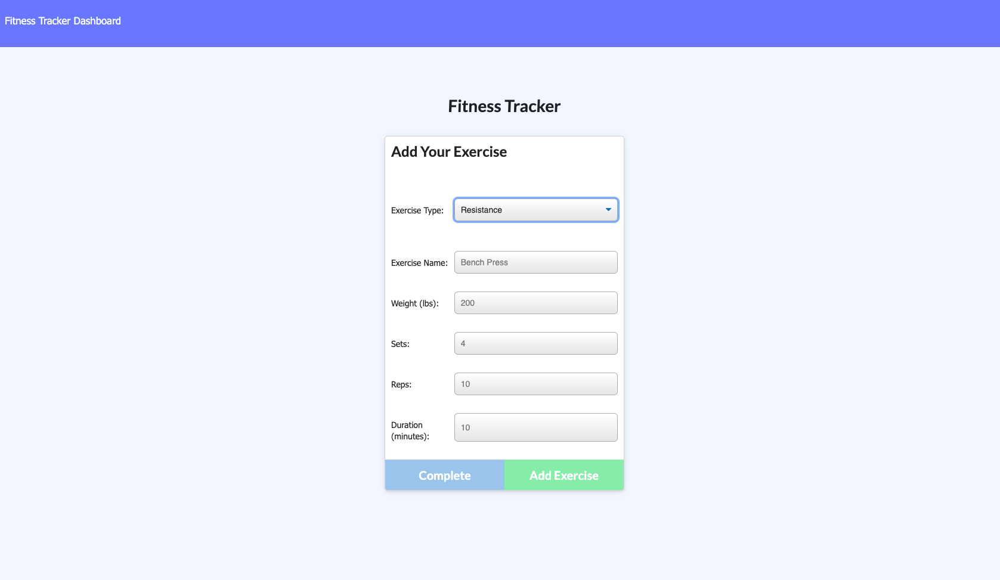
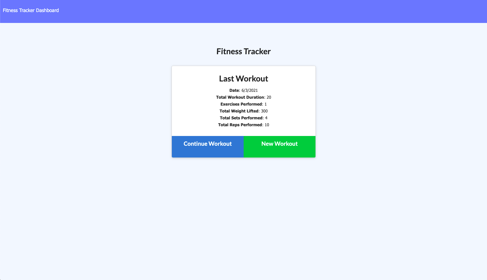
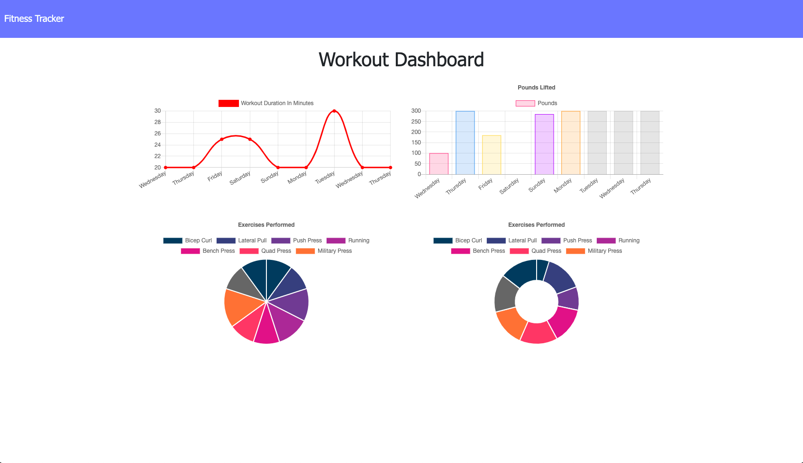

# WorkoutTracker
  ## Description
  Create Mongo database with a Mongoose schema and handle routes with Express. Complete the given code of "Workout Tracker".

  ## Table of Content
  * [Installation](#installation)
  * [Finished_Requirements](#finished_Requirements)
  * [Screenshots](#screenshots)
  * [Live](#live)

  ## Installation
  Clone the repository from GitHub. First install all required dependencies by `npm i`. Create the Mongo database, and seed the file, run `npm run seed`. Run `node server.js` to connect the server. 
  
  ## Finished_Requirements
  * Add exercises to the most recent workout plan.

  * Add new exercises to a new workout plan.

  * View the combined weight of multiple exercises from the past seven workouts on the `stats` page.

  * View the total duration of each workout from the past seven workouts on the `stats` page.

  ## Screenshots
  
  
  

  ## Live
  [heroku](https://sheltered-reaches-79738.herokuapp.com/?id=60bbf037fe11532d1d313594)

  